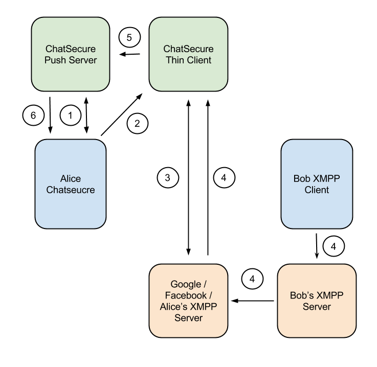

# ChatSecure Push Protocol Version 3.1

This document describes a privacy-conscious and federated way to send Push notifications.

## Definitions

For the purposes of this document you are assumed to be Alice and your buddy is assumed to be Bob.

* `white_list_token` - Unique token generated by the push server.
* `api_endpoint` - Endpoint for instance of push server. Example: "push.chatsecure.org/api/v1/"
* `app_bundle_id` - optional identifier unique to a given app
* `push_info` - `white_list_token` + `api_endpoint` + `app_bundle_id`
* `push_token` - Device-specific unique push token. Example: APNS token.
* `push_payload` - Message contents for the client
* `push_name` - Push username on specific push server / endpoint. Example: "bob"

## How it Works

### Register Alice with App's Push Server

1. Create or login account with desired `push_name` and `password` w/ OAuth. `email_address` is optional during account creation and used for password recovery.
2. Optional: Fund `push_name` with in-app purchase or 'anonymously' via Bitcoin.
3. Register `push_token` with `push_name`.

### Register Alice's Device with Push Server

Alice registers her device's `push_token` with the server.

### Level 1

Both Alice and Bob are using clients that understand the ChatSecure Push Protocol.

Step 1 - Alice retrieves new `white_list_token` for Bob from ChatSecure Push Server.

Step 2 - Alice sends `push_info` to Bob over OTR TLV or other encrypted channel.

**Alice goes offline**

Step 3 - Bob sends the `white_list_token` he received from Alice to Alice's ChatSecure Push Server.

Step 4 - ChatSecure Push Server sends `white_list_token` in `push_payload` to Alice.

Alice now knows which buddy is trying to start a conversation because the `white_list_token` is unique to Bob.

#### Initial Exchange over OTR TLV

1. Ask user to initiate Push handshake. If yes, continue.
2. Alice sends Bob `push_info`.
3. Bob sends Alice `push_info`.

#### Token Rotation

Because the `white_list_token` is sent in the clear to Apple, we should have clients renegotiate and rotate tokens whenever they are able.

### Level 2

Alice has a client that understands the ChatSecure Push Protocol and so does Alice's server. Bob has a normal XMPP client and Server or both understand the ChatSecure Push Protocol.

Step 1 - Alice retrieves new `white_list_token` for Alice's XMPP Server from ChatSecure Push Server.

Step 2 - Alice sends `push_info` to Alice's XMPP Server.

**Alice goes offline**

Step 3 - Bob sends Alice a normal XMPP Message.

Step 4 - Alice's XMPP Server sends `white_list_token` to ChatSecure Push Server.

Step 5 - ChatSecure Push Server sends `white_list_token` in `push_payload` to Alice.

### Level 3

Similar to Level 2 but both Alice and Bob's clients and servers understand the ChatSecure Push Protocol. In this case encrypting the messages is possible using the TextSecure Protocol.

### Google / Facebook / Other XMPP

Alice is using a third party service like Google or Facebook but still wants to receive push notifications to an app the supports the ChatSecure Push Protocol. This is not ideal and works around XMPP limitations and has privacy issues.

ChatSecure Thin Client is a server that signs into your account pretending to be a client in order to receive messages.

Step 1 - Alice retrieves new `white_list_token` for the ChatSecure Thin Client from ChatSecure Push Server.

Step 2 - Alice sends username, domain, port, password or oAuth and `push_info` to the ChatSecure Thin Client.

Step 3 - ChatSecure Thin Client connects to Alice's XMPP Server as a client.

**Alice goes offline**

Step 4 - Bob Sends Alice a normal XMPP message

Step 5 - ChatSeucre Thin Client sends `white_list_token` to ChatSecure Push Server

Step 6 - ChatSecure Push Server sends `white_list_token` in `push_payload` to Alice.

Alice now knows that a message can be retrieved either from the ChatSecure Thin Client or Alice's XMPP Server.

## Sending Push Notification to Offline Contact

1. If Alice is offline and Bob wants to send her a notification, create a notification with the following info:
	* Token: Alice's `white_list_token`
	* Payload: Any other info that should be passed to Alice. May get truncated because of push notification size limit.
2. Send full payload to Alice's `api_endpoint`.

## Server-to-Client Communication

###Apple Push Notifications

#####Content Available

#####Normal Push

1. `white_list_token` received looks up `account_name`.
2. Send push notification with `white_list_token` in `push_payload` to every `push_token` for `account_name`.

## Receiving a Push Notification

Alice receives a push notification

### Apple Push Notifications

#### Content Available

1. The `push_payload` contains the `white_list_token` which can be used to look up the account or buddy it was sent to.
2. The buddy's name can be displayed in the local notification.
2. If it is a `white_list_token` that was sent to a server then messages can be retrieved in the background

#### Regular

